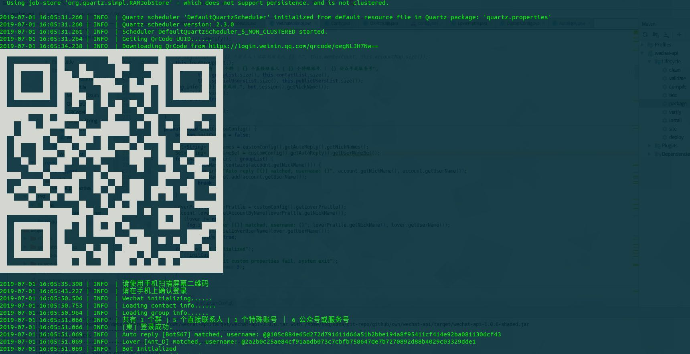
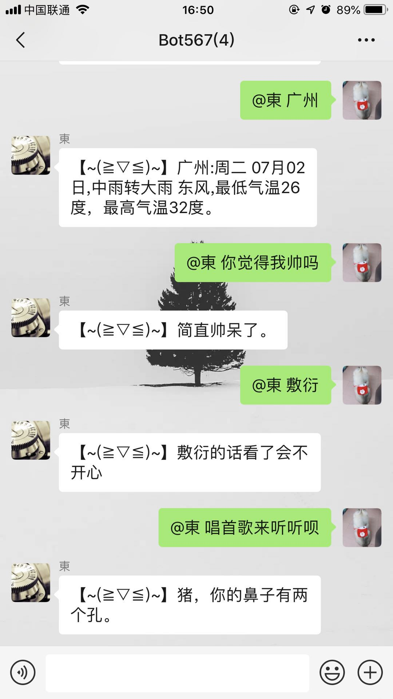
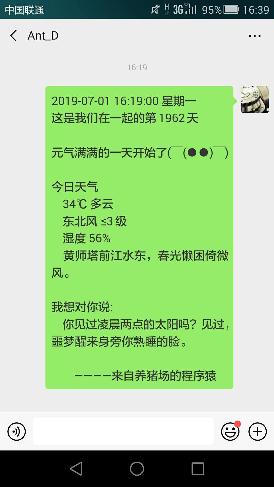

# wechat-bot-java

[](https://github.com/masteranthoneyd/wechat-bot-java) [](https://github.com/masteranthoneyd/wechat-bot-java/blob/master/LICENSE) [](https://github.com/masteranthoneyd/wechat-bot-java) [](https://github.com/masteranthoneyd)[](https://github.com/masteranthoneyd/wechat-bot-java/releases/tag/v2)

`wechat-bot-java` 灵感来源于 *[EverydayWechat](https://github.com/sfyc23/EverydayWechat)*


## Feature

- [x] 每天给女朋友发送土味情话
- [x] 自动拉人进群
- [x] 群新增成员监听并发送欢迎语
- [x] 图灵AI自动回复
- [x] 根据验证信息自动同意添加好友
- [x] 自动骂人

## Show



<div align=center></div>

## Config

请先前往图灵官网注册并获取apiKey, *[http://www.turingapi.com](http://www.turingapi.com)*

`config.yaml`:

```yml
openQrCode: true # 打开二维码, true会调用系统Desktop默认图片浏览工具打开, false在终端显示
loverPrattle: # 每天发送土味情话配置
  enable: true # 是否启动
  cron: 0 0 9 * * ? # 定时任务cron表达式
  city: 广州 # 位置, 用于获取天气
  nickName: 悦 # 女朋友昵称
  fallInLoveAt: 2014-02-15 # 相识日期, 用于计算当天天数
  sweetsWords: 来自养猪场的程序猿 # 钢铁直男的甜密后缀

autoReply: # 自动回复配置
  enable: true # 是否启用
  tulingApiKey: asdasdasdasdasd # 图灵apiKey
  nickNames: # 自动回复名单, 可配置多个, 群回复需要@
    - Bot567
  prefix: 【~(≧▽≦)~】 # 自动回复小尾巴
  
autoCurse: # 自动骂人配置
  enable: true # 是否启用
  fire: false # 是否火力全开, 拉黑必备
  nickNames: # 骂人名单
    - SomePeple 
  
autoVerify: # 自动添加好友验证
  enable: true # 是否启用
  passMessage: # 验证信息包含以下列表时自动通过
    - Java
    - Github
```

## Quick Start

1. 下载 *[最新版本](https://github.com/masteranthoneyd/wechat-bot-java/releases/tag/v2)*
2. 在jar包根目录下配置 `config.yaml`
3. 运行: `java -jar wechat-bot-java-v2.jar`
4. 终端输入 `exit` 或 `quit` 关闭程序

## TODO

- [ ] 接收队列与发送队列解耦, 实现多线程处理消息

## 微信 Web 协议参考
*[https://huangzhike.github.io/2019/01/15/%E7%AC%94%E8%AE%B0-%E5%BE%AE%E4%BF%A1%E5%8D%8F%E8%AE%AE/](https://huangzhike.github.io/2019/01/15/%E7%AC%94%E8%AE%B0-%E5%BE%AE%E4%BF%A1%E5%8D%8F%E8%AE%AE/)*
